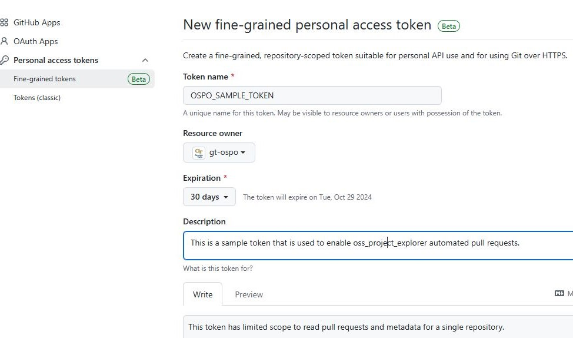

# Developer Documentation for the OSPO Open Source Project Explorer

## 1. Introduction

### 1.1. Project Overview

The purpose of this application is to allow users to add their own open-source projects to a searchable database. Contributors can then search and filter for specific projects they want to contribute to, making it easier to find opportunities aligned with their interests and skills.

This application was developed by the [Open Source Programming Office](https://ospo.cc.gatech.edu/) at the Georgia Institute of Technology in Atlanta, Georgia, USA. The original code is housed in the OSPO [GitHub repository](https://github.com/gt-ospo/oss-project-explorer).

The repository comprises a complete web application, including React UI code and an automated deployment in GitHub Actions workflows.

### 1.2. Technologies Used

This project is built using the following technologies:
- [JavaScript](https://developer.mozilla.org/en-US/docs/Web/JavaScript): The primary programming language used in the project.
- [React](https://reactjs.org/docs/getting-started.html): Used in conjunction with JavaScript to build the user interfaces. 
- [Tailwind CSS](https://tailwindcss.com/docs): A CSS-framework for styling the application.
- [TanStack React Table](https://tanstack.com/table/latest/docs/introduction): A headless table UI library to build the searchable table.
- [Octokit/Github API](https://docs.github.com/en/rest?apiVersion=2022-11-28): A library for interacting with the GitHub API to handle project form submissions.

## 2. Getting Started

In order to work on the UI for this application, you will need [Node.js](https://nodejs.org/en/learn/getting-started/how-to-install-nodejs) installed for the purpose of frontend dependency management via [npm](https://docs.npmjs.com/cli/).

If you do not have a preferred web development IDE, [Visual Studio Code](https://code.visualstudio.com/) is a robust, free option that is popular in the web development community.

You need [Git](https://git-scm.com/) to clone the repository from Github and for version-control.

## 3. Project Structure

The project is organized into several key directories and files. 

### 3.1 `src` Folder
#### 3.1.1 `src/components` Folder

The `components` folder contains the React components used to build the user interface. Each component is organized into its own sub-folder, and the sub-folder contains a single `.jsx` file corresponding to the component name.

- **AboutSection**: Displays information about the project.
- **LicenseFilter**: Handles filtering projects by their licenses.
- **Pagination**: Manages the pagination of the project table.
- **ProjectAreaFilter**: Filters projects by their area of research or focus.
- **ProjectExplorerPage**: The main page where users explore available projects.
- **ProjectFormPage**: Contains the form for users to submit new projects. This is where calls to the Github API using Octokit occur after a user clicks submit. This is also where users are directed to creating a Github Issue if they'd like to request a new project area.
- **ProjectTable**: Displays the list of projects in a table format, allowing for sorting and filtering. Retrieves project data from `project_list.json` in the `src/data` folder.
- **TitleBar**: Displays the title and search bar.

#### 3.1.2 `src/data` Folder

The `data` folder contains files that manage the project's data and options.

- **licenseOptions.jsx**: Contains the available options for project licenses.
- **projectAreaOptions.jsx**: Contains the available options for project areas or research focuses.
- **project_list.json**: The JSON file that contains all project data displayed in the application.

#### 3.1.3 `src` Root Files
- **App.css**: Contains global styles specific to the `App` component.
- **App.jsx**: The main application component that serves as the entry point for the app's UI.
- **App.test.js**: Contains unit tests for the `App` component. No additional unit tests have been added besides the default.
- **index.css**: Contains global styles applied across the entire application.
- **index.jsx**: The entry point for rendering the `App` component into the DOM.
- **logo.svg**: An SVG file used for the application's logo.
- **reportWebVitals.js**: Used for measuring and reporting performance metrics of the app.
- **setupTests.js**: Configures the testing environment and setups before running tests.

### 3.2 `.github` Folder

#### 3.2.1 `.github/workflows` Folder
The `.github/workflows` folder contains the Github Actions yaml files.
- **pages-deploy.yml**: Triggered on pushes to the `main` branch. Builds and deploys application to Github Pages, and replaces the placeholder token in `ProjectForm.jsx` with the Github secret `OSPO_EXPLORER_TOKEN`.

#### 3.2.2 `./github/ISSUE_TEMPLATE`
- **00-project-area-request.yml**: The issue template file used so that users can submit a request to add a new project area.

### 3.3 `public` Folder
The static assets live in this folder. The boilerplate files such as favicon.ico and robots.txt live here. No relevant files are in this folder

### 3.4. Root Files
- **.gitignore**: Specifies which files are to be ignored by git respectively.
- **index.html**: index.html is the template used during the frontend build process. It does not require modification. Any changes made to the body of this file will be replaced when the React code is bundled.
- **LICENSE.txt**: File containing the MIT license for this application.
- **package-lock.json**: package-lock.json is automatically generated when a build is executed.
- **package.json**: The React application is defined in the package.json file, where the available npm commands and dependencies are listed. 
- **postcss.config.js**: Configures PostCSS with `tailwindcss` and `autoprefixer` plugins for CSS processing.
- **tailwind.config.js**: Configures Tailwind CSS, including custom colors, fonts, and paths to template files.
- **vite.config.js**: vite.config.js is where Vite settings reside. The frontend makes use of Vite to provide common local development tooling, including a lightweight development server with hot reload.

## 4. Running the Application Locally
After cloning the [Github repository](https://github.com/gt-ospo/oss-project-explorer) to your local directory, navigate to the root directory of the folder using the `cd` command.

If running this project for the first time, install the necessary packages using:

    $ npm install

After installing the packages, spin up the build locally and open the application in your web browser using:

    $ npm run start

**Note:** You cannot submit new projects on the local build because the Github token is only replaced when the application is deployed to Github Pages.

## 5. Deployment
The deployment process consists of a Github Action that builds the React app and deploys it to Github Pages. This deployment process automatically occurs on any push to the `main` branch, which should happen when merging in from a dev branch or from the branch created when users submit a new project form. This process is defined in the `.github/workflows/pages-deploy.yml` file.

During this deployment, it replaces the string `"OSPO_EXPLORER_TOKEN"` in `ProjectForm.jsx` with a Github secret in the `oss-project-explorer` repository called `OSPO_EXPLORER_TOKEN`. This is necessary so that the application can make calls to the Github API when a user submits a new project form. This token is often generated and managed by a helper account or "bot". 

### 5.1 Helper "Bot" for Deployment

To allow for automated PRs, this repository makes use of an automated "bot" account, seen when new PRs are generated by user submissions on the form. This user creates and uses a fine-grained access token added to the oss-project-explorer repository as a GitHub secret to create a new PR that is then reviewed by one of the repository maintainers.

GitHub provides good guidance on [creating shared bots and services at this page](https://docs.github.com/en/organizations/keeping-your-organization-secure/managing-two-factor-authentication-for-your-organization/managing-bots-and-service-accounts-with-two-factor-authentication), but it is important that all users have access to the bot account (via mail list) and you have set up 2FA for authentication. 

### 5.2 Setting up Fine-grained Access Tokens

GitHub now allows for fine-grained access tokens to perform automated roles for a repository. Read more about fine-grained PAT [at this link](https://github.blog/security/application-security/introducing-fine-grained-personal-access-tokens-for-github/). 

Once you have set up the bot account, you can go under `Settings -> Developer Settings -> Personal access tokens -> Fine-grained tokens` to set up your new `"OSPO_EXPLORER_TOKEN"`. The steps for this are as follows:

1) Check that your organization or hosting repo allows fine-grained access tokens. 
2) Go to your helper user's `Fine-grained tokens` page and `Generate New Token`
3) Enter in the name of your token and select the expiration date. Tokens can last up to 1 year, but we suggest selecting 30 days for testing.

4) Give access for this token **only** to the oss-project-explorer repo under whichever hosting organization you use.

5) Go to `Repository Access` and select permissions for this specific repository using the `Only select repositories` dropdown.
    * We have found that you only need to enable `read-only` access for **Metadata** and `Read and write` access for **Pull Requests** under `Repository permissions`.
6)  Once you have selected this repository and these two permissions, you can select the `Generate token and request access` button.

7)  Copy your new PAT and add it as a GitHub secret under your version of the oss-project-explorer repository. 

**IMPORTANT NOTE**: Your newly generated PAT will only show once when you generate it. Save it in a safe location for usage as a GitHub Secret with the oss-project-explorer repository.

### 5.3 Renewing your Fine-grained Acess Tokens

You should receive an email notice if your token is about to expire. Using your helper bot account, you can go under `Settings -> Developer Settings -> Personal access tokens -> Fine-grained tokens` to regenerate your new `"OSPO_EXPLORER_TOKEN"` using the `Regenerate token` button. Remember to copy and save your token in a safe space!

You can copy the new value of your token to the oss-project-explorer repository by going to the repository (as any authorized user), and going to `Settings -> Secrets and Variables -> Actions` and editing the existing token value. Copy your new token value into the provided field and select the `Update Secret` button.

Once you have created or updated your secret, please remember to test that your new PAT has the correct permissions. You can do this by going to the main web interface, filling in the form, and submitting a new entry. If the PAT is set up correctly, your PR should show up under the Pull Request tab with your submission. 

## 6. Maintenance

### 6.1. Reviewing New Project Submissions
When users submit new project forms, a pull request is made from a separate branch created by the gt-ospo-bot. This branch has the new project information added to the `project_list.json` file. Administrators of this repository will have to manually review each pull request and merge in ones that have a valid project form.

### 6.2 Reviewing New Project Area Issues
When users submit an issue to add a new project area, we must review them manually. If we approve, we must go to their PR make for their project submission, merge the PR and adjust the project area field in their project to include their new area.

### 6.3. Updating Dependencies
GitHub's Dependabot is enabled for the repository which will create PRs for critical dependency updates. 

To manually maintain the React dependencies, run the `npm outdated` command to see a list of dependencies that need attention. The concerning ones will be presented in red type. From here upgrading dependencies can be done using `npm upgrade <package name>`.

### 6.4. Troubleshooting
To diagnose if an issue is UI related, load the application in a browser with the dev tools open.

You can see JavaScript errors in the Console tab of the dev tools.

Certain issues will be a result of the interaction with the Github API. Opening up the "Network" tab on the dev tools will allow you to see all REST and socket traffic. You can then dive into each request and its response.

*Error due to an invalid Github token when trying to call the Github API after submitting a new project form*

## 7. User Workflow in the React Application

### 7.1. Exploring Projects

The main landing page is powered by the `ProjectExplorer.jsx` file, which integrates several key components: `ProjectForm`, `AboutSection`, `TitleBar`, `ProjectAreaFilter`, `LicenseFilter`, and `ProjectTable`.

1. **Filtering Projects**:
   - Users can filter projects by specific criteria such as project area or license using the filter components.
   - When a user interacts with the project area or license filters, the corresponding `handle{Filter}Change` method (`handleProjectAreaChange` or `handleLicenseChange`) is invoked. These methods update the state variables (`selectedProjectAreas` and `selectedLicenses`), which in turn update the `columnFilters` state via the `useEffect` hooks. This ensures that the table displays only the projects matching the selected filters.
   - Similarly, typing into the search bar updates the `projectName` filter through the `handleSearchBarChange` method, allowing users to search for projects by name.

2. **Displaying Projects**:
   - The `ProjectTable` component is responsible for rendering the filtered list of projects in a table format.
   - As users apply different filters or search queries, the `columnFilters` state is passed down to the `ProjectTable` component, which then dynamically updates the displayed projects to match the user's criteria.

3. **Viewing Project Details**:
   - Users can expand a row in the `ProjectTable` to view detailed information about a project, such as its abstract, primary contacts, and related URLs. This interaction is handled within the `ProjectTable` component.

### 7.2. Submitting a New Project

The application also allows users to submit new open-source projects for inclusion in the database.

1. **Accessing the Submission Form**:
   - The `ProjectExplorer.jsx` component includes a button that toggles the visibility of the project submission form, managed by the `handleShowForm` method.
   - When the "Submit New Project" button is clicked, `handleShowForm` toggles the `showForm` state. If the form is being opened, it also scrolls the `ProjectForm` component into view using a smooth scroll effect.

2. **Filling Out the Form**:
   - The `ProjectForm` component, when rendered, provides fields for users to enter project details such as the project name, abstract, areas of research, licenses, contacts, and relevant URLs.
   - The form includes validation logic to ensure that all required fields are correctly filled out before submission.

3. **Submitting the Project**:
   - Upon submission, the form data is processed and sent via the GitHub API using the `Octokit` library, as described in the `ProjectForm.jsx` file.
   - A new branch is created in the repository, and the project details are added to `project_list.json`. Finally, a pull request is automatically generated for review by the OSPO repository maintainers.

4. **Confirmation and Review**:
   - After successfully submitting the form, the user receives a confirmation message. The new project undergoes a review process before being added to the public project list.
